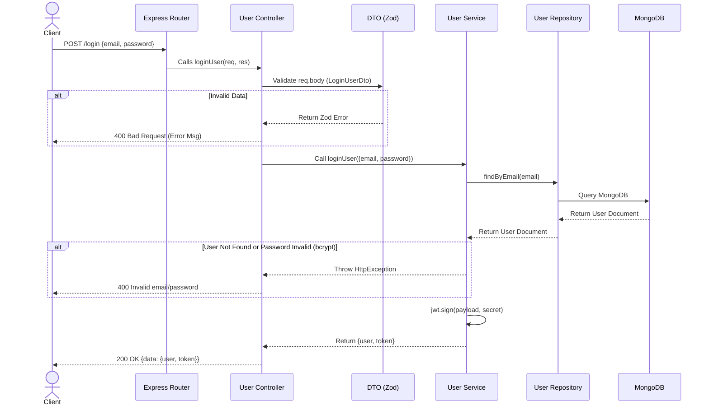

# Web API Authentication Workflow

This document outlines the workflow and architecture of your authentication API (built with Node.js, Express, and TypeScript) and explains how this exact structure maps to building "actual code" in Next.js.

## 1. Architecture Overview (Layered Pattern)

Your project is built using a clean, layered architecture (often called the **Controller-Service-Repository** pattern). This keeps your code organized so that each file has a single responsibility:

1. **Routes (`routes/`)**: Defines the URLs (e.g., `/login`) and points them to a specific Controller.
2. **Controllers (`controllers/`)**: The "Traffic Cops". They receive the request from the route, validate the data using DTOs/Zod, and pass the data to the Service. Finally, they send the HTTP response back to the user.
3. **Services (`services/`)**: The "Brains". This is where your business logic lives. Things like hashing passwords, checking if emails exist, and generating JWT tokens happen here.
4. **Repositories (`repositories/`)**: The "Database Translators". Their only job is to interact directly with MongoDB (using Mongoose). They abstract away complex database queries.
5. **Models (`models/`)**: Defines the structure of your data in the database (Mongoose Schemas).
6. **DTOs (`dtos/`)**: Data Transfer Objects. Defines the exact shape of data expected from the client (using Zod validation).

## 2. Authentication Workflow Diagram

Here is a step-by-step visual of what happens when a user tries to Register or Login.



## 3. Step-by-Step Guide: How to write this code from scratch

Whenever you need to create a new feature (e.g., adding "Products"), you should always work from the bottom layer (Database) up to the top layer (Routes).

**Step 1: Define the Type & Model (`types/` & `models/`)**
* Write the TypeScript type (`ProductType`) so TypeScript knows what a product looks like.
* Write the Mongoose Schema (`ProductModel`) so MongoDB knows how to save it.

**Step 2: Create the Repository (`repositories/`)**
* Create `ProductRepository` with methods like `createProduct()`, `findProductById()`.
* The repository only runs MongoDB queries (e.g., `ProductModel.create(data)`).

**Step 3: Define the Validation / DTOs (`dtos/`)**
* Use Zod to create `CreateProductDto`. This guarantees that when a user sends data, it has the exact fields (e.g., `price` must be a number).

**Step 4: Write the Business Logic (`services/`)**
* Create `ProductService`. 
* Write a `createProduct` method that checks business rules (e.g., "Is this product name already taken?").
* The Service calls the Repository to actually save it to the DB.

**Step 5: Write the Controller (`controllers/`)**
* Create `ProductController`.
* Write a method that takes `req` and `res`.
* Pass `req.body` into your Zod DTO to validate it.
* Pass the validated data to the Service.
* Return a standardized `ApiResponseHelper.success(res, ...)`.

**Step 6: Expose the Route (`routes/`)**
* Create `product.routes.ts`.
* Attach `router.post("/products", productController.createProduct)`.
* Add this router to your main `index.ts` or `app.ts` file.

---

## 4. Definitions of Complex Terms

*   **Zod**: A TypeScript-first schema declaration and data validation library. You use it in your `dtos` to ensure the JSON sent by the frontend is exactly what you expect (e.g., `email` is actually a valid email format, `password` is a string). It prevents bad data from reaching your database.
*   **bcrypt**: A library used to securely hash passwords. You **never** save plain-text passwords in a database. Bcrypt scrambles the password into a secure hash (`$2b$10$...`) that cannot be reversed. To log in, bcrypt compares the entered password against the saved hash.
*   **.env (Environment Variables)**: A file used to store secret keys, database connection strings (like your MongoDB URI), and port numbers. This file is **never** pushed to GitHub (via `.gitignore`) so hackers cannot steal your passwords or secret keys.
*   **JWT (JSON Web Token)**: A secure string token generated after a successful login. It acts as a digital ID card. The backend gives the client a JWT, and the client sends that JWT back in the "Authorization" header for every future request to prove they are logged in.
*   **DTO (Data Transfer Object)**: A pattern used to strictly define what data should look like when it travels from the Client (Frontend) to the Server (Backend). In your code, you map DTOs to Zod schemas to validate incoming traffic.
*   **Repository Pattern**: A design pattern that separates the code that talks to the database (Mongoose) from your main business logic. This makes it very easy to test code or switch databases in the future.
*   **Middleware**: Functions that run *in the middle* of a request. For example, your `authorized.middleware.ts` intercepts requests, checks if the user has a valid JWT, and either blocks them or lets them through to the Controller.

---

## 5. How to do this in Next.js (App Router)

Next.js is a full-stack framework. You can run React (frontend) and Node.js (backend) in the same project. The architecture you used in Express transfers perfectly to Next.js, with only one major difference: **Controllers and Routes are combined into "Route Handlers" or "Server Actions".**

### The Next.js Folder Structure mapping:

*   `src/models/` ➡️ Stays exactly the same in Next.js.
*   `src/repositories/` ➡️ Stays exactly the same in Next.js.
*   `src/services/` ➡️ Stays exactly the same in Next.js.
*   `src/dtos/` ➡️ Stays exactly the same in Next.js.
*   **`src/routes/` and `src/controllers/` ➡️ Replaced by `app/api/.../route.ts` (Next.js Route Handlers)**

### Example: Converting your Express Login to Next.js

Instead of an Express Controller and Route, you create a file at `app/api/auth/login/route.ts`:

```typescript
// app/api/auth/login/route.ts
import { NextResponse } from 'next/server';
import { UserService } from "@/services/user.service";
import { LoginUserDto } from "@/dtos/user.dto";

const userService = new UserService();

export async function POST(request: Request) {
    try {
        // 1. Get the body
        const body = await request.json();
        
        // 2. Validate with Zod (DTO)
        const parseResult = LoginUserDto.safeParse(body);
        if (!parseResult.success) {
            return NextResponse.json({ error: "Invalid data" }, { status: 400 });
        }

        // 3. Call the exact same Service logic you already wrote!
        const { user, token } = await userService.loginUser(parseResult.data);

        // 4. Return success
        return NextResponse.json({ user, token }, { status: 200 });

    } catch (error: any) {
        return NextResponse.json({ error: error.message }, { status: 400 });
    }
}
```

**Why this architecture is excellent for Next.js:**
Because you kept your database queries (`Repository`) and business logic (`Service`) totally separate from Express (`Controller`), you can literally copy and paste your `Service`, `Repository`, `Model`, and `DTO` folders into a Next.js project and they will work perfectly. You only have to rewrite the web-facing part (the controllers).